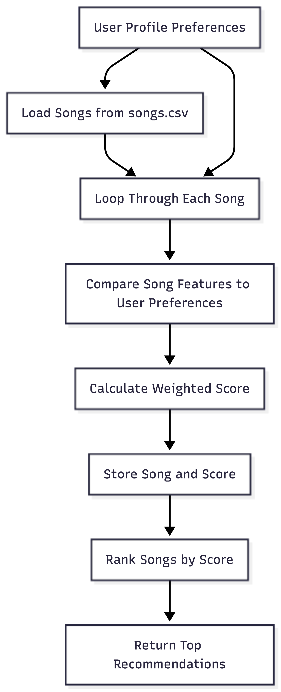
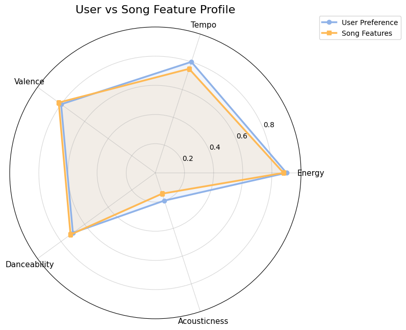
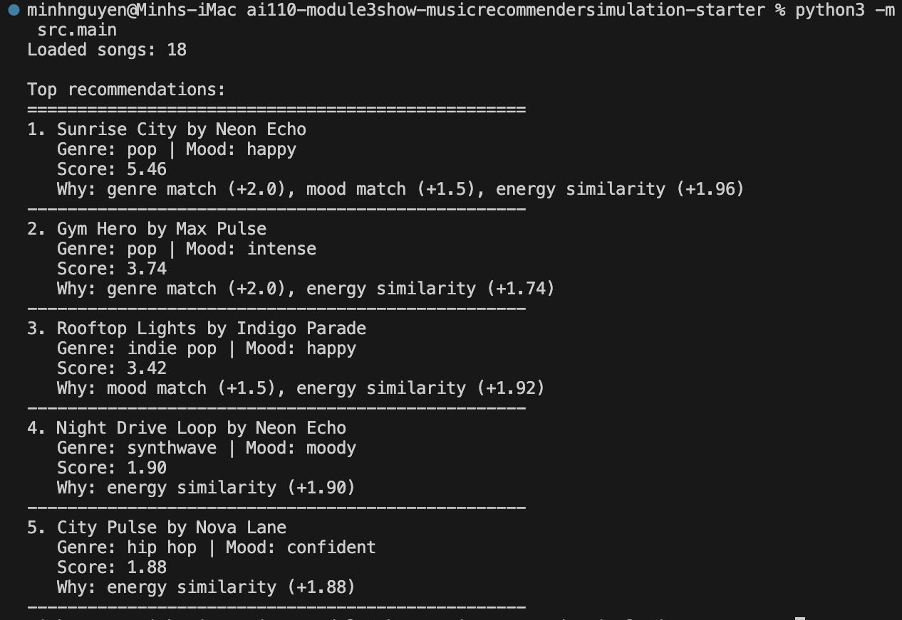

# 🎵 Music Recommender Simulation

## Project Summary

This project simulates a simple content-based music recommender system. Songs are represented using features such as genre, mood, energy, tempo, and valence. A user profile stores preferred values for these features to represent a listener’s taste.

The recommender compares each song’s attributes to the user’s preferences and calculates a weighted score based on how closely they match. Songs with higher scores are ranked higher and returned as recommendations. This simulation demonstrates how recommendation systems transform structured data into predictions by combining feature similarity with a ranking algorithm.

---

## How The System Works

The system works by comparing song attributes to a user’s taste profile and calculating how closely they match.

Each **Song** includes the following features from the dataset:

- genre
- mood
- energy
- tempo_bpm
- valence

The **UserProfile** stores the listener’s preferred values for these features, such as their favorite genre, mood, and preferred energy level.

The **Recommender** calculates a score for every song in the catalog using a weighted scoring rule:

- If the song’s **genre matches** the user’s preferred genre, it adds a large score bonus.
- If the **mood matches**, it adds a smaller bonus.
- For numerical features like **energy**, **tempo**, and **valence**, the score increases when the song’s value is closer to the user’s preference.

After calculating scores for all songs, the system **sorts songs by score from highest to lowest**. The top ranked songs are returned as recommendations.

This approach simulates a **content-based filtering recommender**, where recommendations are based on song attributes rather than other users’ listening behavior.

---

## Algorithm Overview



The diagram above shows the flow of the recommendation process:

1. A **user profile** defines listening preferences.
2. The system **loads songs from the dataset**.
3. Each song is **scored based on feature similarity**.
4. Scores are adjusted using the **weighted scoring rule**.
5. A **diversity penalty** reduces repeated artists or genres.
6. Songs are **ranked by final score**.
7. The system **returns the top recommendations**.

---

## Algorithm Recipe

The recommender calculates a score for each song based on how closely the song’s features match the user's preferences.

Scoring rules:

- **+1.0 points** if the song's genre matches the user's favorite genre.
- **+1.5 points** if the song's mood matches the user's favorite mood.

Similarity scoring for numerical features:

- **Energy similarity**  
  `1 - abs(song_energy - target_energy)`  
  weighted by **4.0**
  
- **Tempo similarity**  
  `1 - min(abs(song_tempo - target_tempo) / 100, 1)`  
  weighted by **1.5**

- **Valence similarity**  
  `1 - abs(song_valence - target_valence)`  
  weighted by **1.0**

After scoring every song in the dataset, the system sorts the songs by total score from highest to lowest and returns the top recommendations.

---

## User Preference vs Song Feature Comparison



This radar chart compares a user's listening preferences with the feature profile of a recommended song.  
The closer the shapes overlap, the better the song matches the user's taste profile.

---

## Example Recommendation Output

Example recommendations for a **High-Energy Pop** user profile:

1. Sunrise City by Neon Echo
   Genre: pop | Mood: happy
   Score: 6.18
   Why: genre match (+1.0), mood match (+1.5), energy similarity (+3.68)

2. Rooftop Lights by Indigo Parade
   Genre: indie pop | Mood: happy
   Score: 4.94
   Why: mood match (+1.5), energy similarity (+3.44)

3. Gym Hero by Max Pulse
   Genre: pop | Mood: intense
   Score: 4.38
   Why: genre match (+1.0), energy similarity (+3.88), genre diversity penalty (-0.50)

---

## CLI Demo

Below is an example of the recommender running in the terminal.



---

## Getting Started

### Setup

1. Create a virtual environment (optional but recommended):

```bash
python -m venv .venv
source .venv/bin/activate      # Mac or Linux
.venv\Scripts\activate         # Windows
```

2. Install dependencies

```bash
pip install -r requirements.txt
```

3. Run the app:

```bash
python -m src.main
```

### Running Tests

Run the starter tests with:

```bash
pytest
```

You can add more tests in `tests/test_recommender.py`.

---

## Experiments You Tried

During evaluation, the scoring weights were modified to test how the system responds to different feature importance.

The weight of **energy similarity** was increased while the weight of **genre matching** was reduced. This experiment showed that recommendations became more sensitive to intensity and musical energy.

This demonstrated how small weight changes can significantly affect recommendation rankings.

---

## Limitations and Bias

This recommender has several limitations:

- The dataset is very small (18 songs).
- It does not analyze lyrics, artists' popularity, or listening history.
- Certain genres may appear more frequently due to dataset imbalance.
- User preferences are simplified and may not fully represent real musical taste.

These limitations are discussed further in the **Model Card**.

### Potential Bias

This recommender may over-prioritize certain features, especially genre. Because genre has a strong weight in the scoring rule, the system may repeatedly recommend songs from the same genre even if other songs match the user's mood or energy well. This could reduce diversity in recommendations and create a small "filter bubble" effect.

---

## Model Card

For a full description of the model design, evaluation process, and biases, see:

[Model Card](model_card.md)

---

## Reflection

Building this recommender helped illustrate how recommendation systems transform structured data into ranked predictions. Even a simple scoring model can generate results that feel meaningful to users when the system captures important features like genre, mood, and energy.

One surprising observation was how sensitive the system is to weight changes. When the energy weight increased and the genre weight decreased, the recommendations shifted significantly toward songs with similar intensity levels. This demonstrated how small adjustments in scoring rules can strongly influence recommendation outcomes.